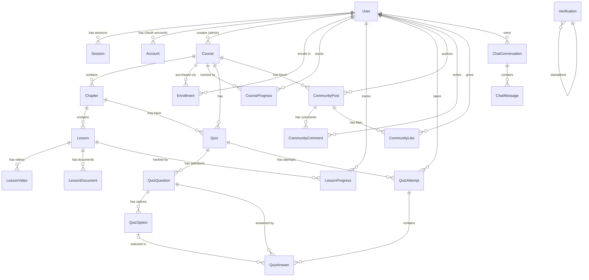
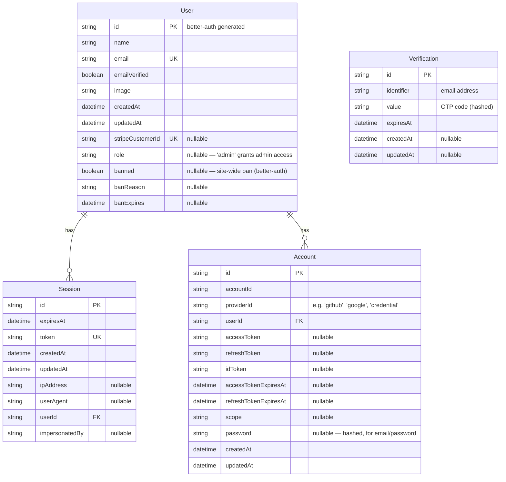
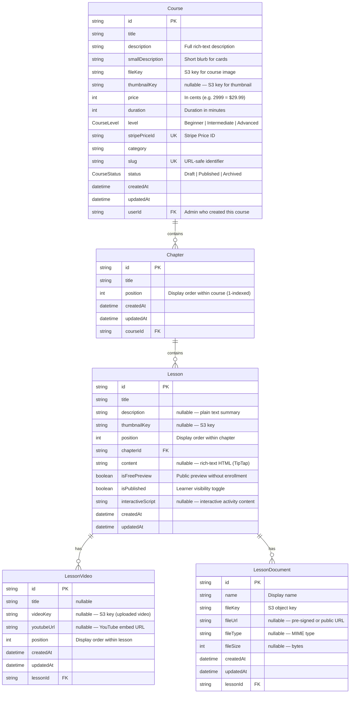
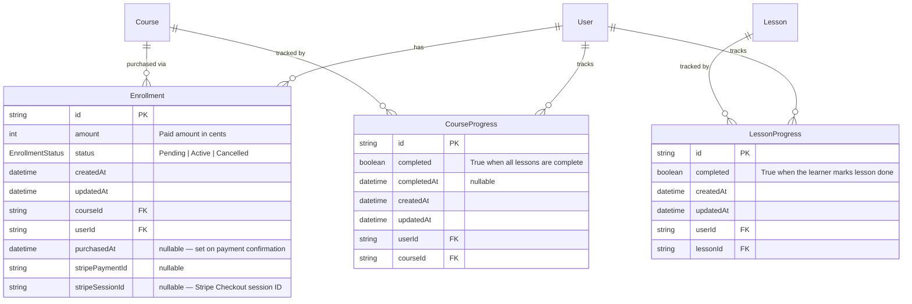
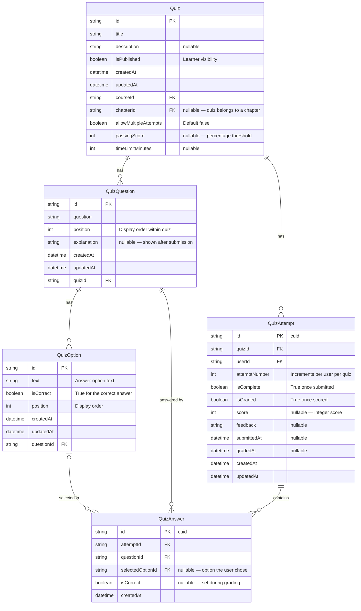
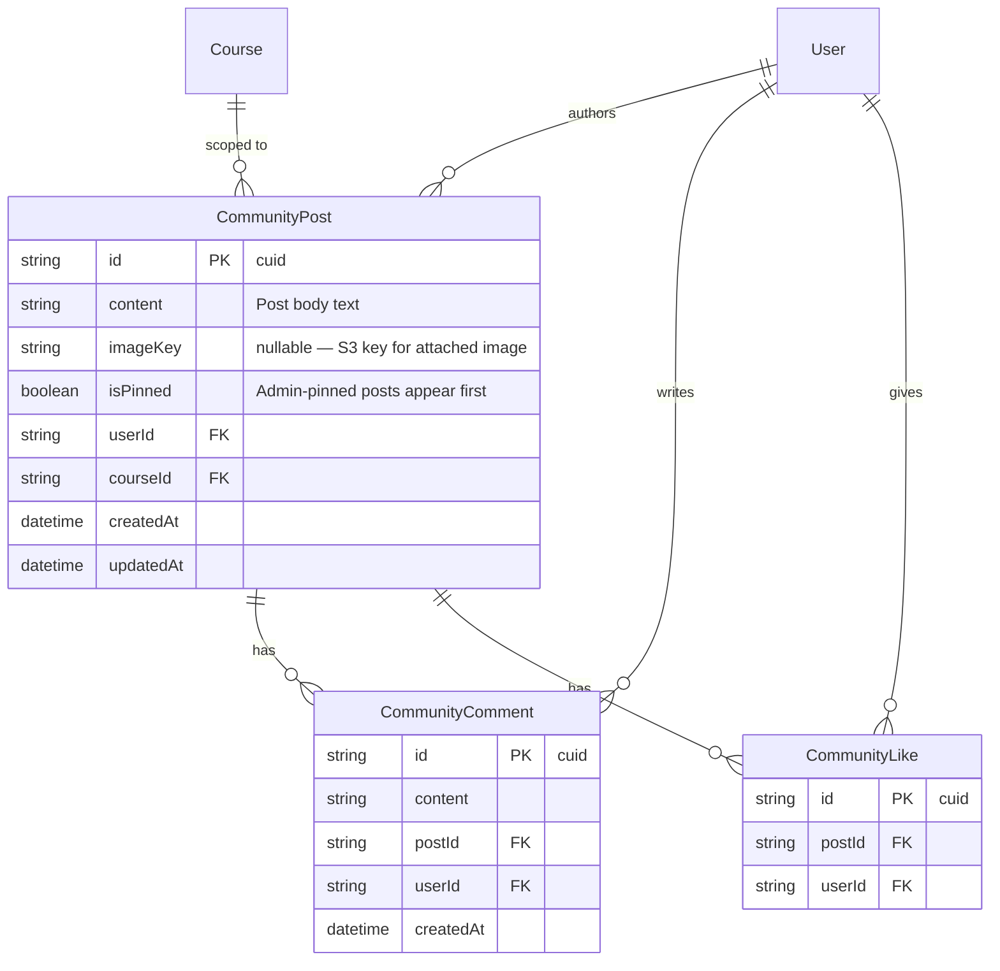
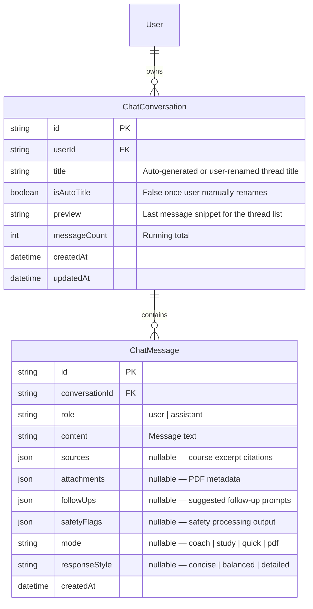

# Database Schema & Entity Relationship Diagrams

Health Academy LMS uses **PostgreSQL** (hosted on [Neon](https://neon.tech/)) accessed through **Prisma ORM**. The canonical source of truth is [`prisma/schema.prisma`](../prisma/schema.prisma).

---

## Table of Contents

1. [Full Relationship Overview](#1-full-relationship-overview)
2. [Domain: Auth & Users](#2-domain-auth--users)
3. [Domain: Course Content](#3-domain-course-content)
4. [Domain: Enrollment & Progress](#4-domain-enrollment--progress)
5. [Domain: Quizzes](#5-domain-quizzes)
6. [Domain: Community Forum](#6-domain-community-forum)
7. [Domain: AI Advisor Chat](#7-domain-ai-advisor-chat)
8. [Field Reference Tables](#8-field-reference-tables)
9. [Enums](#9-enums)
10. [Indexes & Unique Constraints](#10-indexes--unique-constraints)

---

## 1. Full Relationship Overview

This diagram shows all 18 models and how they connect. Field details are in the domain sections below.



---

## 2. Domain: Auth & Users

These models are **managed by better-auth**. Do not modify them manually unless you understand the better-auth schema contract.



### Notes

- `User.role` — only `"admin"` is recognized by the app. All other users (including `null`) are treated as regular learners.
- `User.banned` — triggers a site-wide block enforced by the `admin()` better-auth plugin. **Do not use this field for community-only bans** — see the  for the distinction issue.
- `Account` — one row per OAuth provider linked to the user (GitHub, Google). Also used for credential (email/password) accounts.
- `Verification` — stores OTP codes for email-OTP sign-in. Managed entirely by better-auth; rows are cleaned up on use or expiry.

---

## 3. Domain: Course Content

The core content hierarchy: **Course → Chapter → Lesson → Video / Document**.



### Notes

- `Course.price` and `Enrollment.amount` are stored in **cents** (Stripe standard). $29.99 = `2999`.
- `Course.stripePriceId` must be created in the Stripe dashboard first and then set on the course record. It is unique — one Stripe Price per course.
- A `LessonVideo` row holds either a `videoKey` (S3 upload) **or** a `youtubeUrl`, never both.
- `Lesson.content` is the TipTap rich-text editor output stored as HTML. It can contain text, tables, and embedded images.
- `Chapter.position` and `Lesson.position` have a unique constraint per parent — `(courseId, position)` and `(chapterId, position)` respectively. Reordering uses a DnD UI in the admin panel.

---

## 4. Domain: Enrollment & Progress

Tracks what learners have purchased and how far they have progressed.



### Enrollment Lifecycle

```
User clicks "Enroll Now"
       │
       ▼
Enrollment created (status = Pending, stripeSessionId set)
       │
       ▼
User completes Stripe Checkout
       │
       ▼
Stripe fires checkout.session.completed webhook
       │
       ▼
/api/webhook/stripe updates Enrollment (status = Active, amount set)
       │
       ▼
Learner can access course content
```

- Only `Active` enrollments grant access to course content.
- `Enrollment` has a unique constraint on `(userId, courseId)` — one enrollment per user per course.
- `CourseProgress.completed` is derived from all lessons being complete — update logic lives in the lesson-completion server action.

---

## 5. Domain: Quizzes

Supports multiple-choice quizzes attached to chapters, with scored attempts.



### Notes

- `QuizAttempt` has a unique constraint on `(quizId, userId, attemptNumber)`. If `allowMultipleAttempts` is false, users are blocked from starting a second attempt.
- `QuizAnswer` has a unique constraint on `(attemptId, questionId)` — one answer per question per attempt.
- `QuizOption.isCorrect` is the ground truth. `QuizAnswer.isCorrect` is derived on grading.
- Quizzes are currently attached to chapters via `chapterId`. A `position` field (to allow ordering relative to lessons) is a planned improvement.

---

## 6. Domain: Community Forum

Per-course discussion board with posts, threaded comments, and likes.



### Notes

- `CommunityLike` has a unique constraint on `(postId, userId)` — one like per user per post. Toggling calls an upsert/delete pattern.
- Posts are scoped to a `courseId` — learners only see the forum for courses they are enrolled in.
- `CommunityPost.isPinned` allows admins to highlight important announcements at the top of the feed.
- User bans are checked before creating posts, comments, or likes (see `app/actions/community/`).

---

## 7. Domain: AI Advisor Chat

Persistent multi-thread conversation storage for the AI Advisor feature.



### Notes

- Each conversation retains the most recent **40 messages**. Older messages are pruned on write.
- Only the most recent **16 messages** (~8 turns) are sent to the LLM. Earlier turns are condensed into a running summary injected into the system prompt.
- `ChatMessage.sources` — JSON array of `{ title, excerpt, courseTitle }` objects used to render source badge UI in the chat.
- `ChatMessage.attachments` — JSON metadata for user-uploaded PDFs (filename, extracted text snippet).
- `ChatMessage.safetyFlags` — output from `lib/chat/safety.ts` pre/post processing.

---

## 8. Field Reference Tables

### User

| Field | DB Type | Nullable | Default | Notes |
|-------|---------|----------|---------|-------|
| `id` | TEXT | No | — | better-auth generated ID |
| `name` | TEXT | No | — | |
| `email` | TEXT | No | — | Unique |
| `emailVerified` | BOOLEAN | No | — | |
| `image` | TEXT | Yes | — | Avatar URL |
| `createdAt` | TIMESTAMPTZ | No | — | |
| `updatedAt` | TIMESTAMPTZ | No | — | |
| `stripeCustomerId` | TEXT | Yes | — | Unique. Set on first Stripe checkout. |
| `role` | TEXT | Yes | — | `"admin"` = admin access |
| `banned` | BOOLEAN | Yes | — | Site-wide ban (better-auth enforced) |
| `banReason` | TEXT | Yes | — | |
| `banExpires` | TIMESTAMPTZ | Yes | — | Null = permanent if banned |

### Session

| Field | DB Type | Nullable | Default | Notes |
|-------|---------|----------|---------|-------|
| `id` | TEXT | No | — | |
| `expiresAt` | TIMESTAMPTZ | No | — | |
| `token` | TEXT | No | — | Unique |
| `createdAt` | TIMESTAMPTZ | No | — | |
| `updatedAt` | TIMESTAMPTZ | No | — | |
| `ipAddress` | TEXT | Yes | — | |
| `userAgent` | TEXT | Yes | — | |
| `userId` | TEXT | No | — | FK → User |
| `impersonatedBy` | TEXT | Yes | — | better-auth admin impersonation |

### Account

| Field | DB Type | Nullable | Default | Notes |
|-------|---------|----------|---------|-------|
| `id` | TEXT | No | — | |
| `accountId` | TEXT | No | — | Provider-specific user ID |
| `providerId` | TEXT | No | — | `"github"`, `"google"`, `"credential"` |
| `userId` | TEXT | No | — | FK → User |
| `accessToken` | TEXT | Yes | — | |
| `refreshToken` | TEXT | Yes | — | |
| `idToken` | TEXT | Yes | — | |
| `accessTokenExpiresAt` | TIMESTAMPTZ | Yes | — | |
| `refreshTokenExpiresAt` | TIMESTAMPTZ | Yes | — | |
| `scope` | TEXT | Yes | — | |
| `password` | TEXT | Yes | — | Hashed, for credential accounts |
| `createdAt` | TIMESTAMPTZ | No | — | |
| `updatedAt` | TIMESTAMPTZ | No | — | |

### Verification

| Field | DB Type | Nullable | Default | Notes |
|-------|---------|----------|---------|-------|
| `id` | TEXT | No | — | |
| `identifier` | TEXT | No | — | Email address |
| `value` | TEXT | No | — | Hashed OTP code |
| `expiresAt` | TIMESTAMPTZ | No | — | |
| `createdAt` | TIMESTAMPTZ | Yes | — | |
| `updatedAt` | TIMESTAMPTZ | Yes | — | |

### Course

| Field | DB Type | Nullable | Default | Notes |
|-------|---------|----------|---------|-------|
| `id` | TEXT | No | uuid() | |
| `title` | TEXT | No | — | |
| `description` | TEXT | No | — | Full description |
| `smallDescription` | TEXT | No | — | Card blurb |
| `fileKey` | TEXT | No | — | S3 key for course image |
| `thumbnailKey` | TEXT | Yes | — | S3 key for thumbnail |
| `price` | INT4 | No | — | **In cents** |
| `duration` | INT4 | No | — | Duration in minutes |
| `level` | TEXT | No | `Beginner` | Enum: CourseLevel |
| `stripePriceId` | TEXT | No | — | Unique. Stripe Price ID. |
| `category` | TEXT | No | — | |
| `slug` | TEXT | No | — | Unique. URL-safe. |
| `status` | TEXT | No | `Draft` | Enum: CourseStatus |
| `createdAt` | TIMESTAMPTZ | No | now() | |
| `updatedAt` | TIMESTAMPTZ | No | — | |
| `userId` | TEXT | No | — | FK → User (creator) |

### Chapter

| Field | DB Type | Nullable | Default | Notes |
|-------|---------|----------|---------|-------|
| `id` | TEXT | No | uuid() | |
| `title` | TEXT | No | — | |
| `position` | INT4 | No | — | Unique per course |
| `createdAt` | TIMESTAMPTZ | No | now() | |
| `updatedAt` | TIMESTAMPTZ | No | — | |
| `courseId` | TEXT | No | — | FK → Course |

### Lesson

| Field | DB Type | Nullable | Default | Notes |
|-------|---------|----------|---------|-------|
| `id` | TEXT | No | uuid() | |
| `title` | TEXT | No | — | |
| `description` | TEXT | Yes | — | Plain text |
| `thumbnailKey` | TEXT | Yes | — | S3 key |
| `position` | INT4 | No | — | Unique per chapter |
| `chapterId` | TEXT | No | — | FK → Chapter |
| `content` | TEXT | Yes | — | Rich-text HTML (TipTap) |
| `isFreePreview` | BOOLEAN | No | false | |
| `isPublished` | BOOLEAN | No | false | |
| `interactiveScript` | TEXT | Yes | — | Interactive activity content |
| `createdAt` | TIMESTAMPTZ | No | now() | |
| `updatedAt` | TIMESTAMPTZ | No | — | |

### LessonVideo

| Field | DB Type | Nullable | Default | Notes |
|-------|---------|----------|---------|-------|
| `id` | TEXT | No | uuid() | |
| `title` | TEXT | Yes | — | |
| `videoKey` | TEXT | Yes | — | S3 key (mutually exclusive with youtubeUrl) |
| `youtubeUrl` | TEXT | Yes | — | YouTube embed URL |
| `position` | INT4 | No | — | Display order |
| `createdAt` | TIMESTAMPTZ | No | now() | |
| `updatedAt` | TIMESTAMPTZ | No | — | |
| `lessonId` | TEXT | No | — | FK → Lesson |

### LessonDocument

| Field | DB Type | Nullable | Default | Notes |
|-------|---------|----------|---------|-------|
| `id` | TEXT | No | uuid() | |
| `name` | TEXT | No | — | Display name |
| `fileKey` | TEXT | No | — | S3 object key |
| `fileUrl` | TEXT | Yes | — | Pre-signed or public URL |
| `fileType` | TEXT | Yes | — | MIME type |
| `fileSize` | INT4 | Yes | — | Bytes |
| `createdAt` | TIMESTAMPTZ | No | now() | |
| `updatedAt` | TIMESTAMPTZ | No | — | |
| `lessonId` | TEXT | No | — | FK → Lesson |

### Enrollment

| Field | DB Type | Nullable | Default | Notes |
|-------|---------|----------|---------|-------|
| `id` | TEXT | No | uuid() | |
| `amount` | INT4 | No | — | **In cents** |
| `status` | TEXT | No | `Pending` | Enum: EnrollmentStatus |
| `createdAt` | TIMESTAMPTZ | No | now() | |
| `updatedAt` | TIMESTAMPTZ | No | — | |
| `courseId` | TEXT | No | — | FK → Course |
| `userId` | TEXT | No | — | FK → User |
| `purchasedAt` | TIMESTAMPTZ | Yes | — | Set when status → Active |
| `stripePaymentId` | TEXT | Yes | — | |
| `stripeSessionId` | TEXT | Yes | — | Stripe Checkout Session ID |

### CourseProgress

| Field | DB Type | Nullable | Default | Notes |
|-------|---------|----------|---------|-------|
| `id` | TEXT | No | uuid() | |
| `completed` | BOOLEAN | No | false | |
| `completedAt` | TIMESTAMPTZ | Yes | — | |
| `createdAt` | TIMESTAMPTZ | No | now() | |
| `updatedAt` | TIMESTAMPTZ | No | — | |
| `userId` | TEXT | No | — | FK → User |
| `courseId` | TEXT | No | — | FK → Course |

### LessonProgress

| Field | DB Type | Nullable | Default | Notes |
|-------|---------|----------|---------|-------|
| `id` | TEXT | No | uuid() | |
| `completed` | BOOLEAN | No | false | |
| `createdAt` | TIMESTAMPTZ | No | now() | |
| `updatedAt` | TIMESTAMPTZ | No | — | |
| `userId` | TEXT | No | — | FK → User |
| `lessonId` | TEXT | No | — | FK → Lesson |

### Quiz

| Field | DB Type | Nullable | Default | Notes |
|-------|---------|----------|---------|-------|
| `id` | TEXT | No | uuid() | |
| `title` | TEXT | No | — | |
| `description` | TEXT | Yes | — | |
| `isPublished` | BOOLEAN | No | false | |
| `createdAt` | TIMESTAMPTZ | No | now() | |
| `updatedAt` | TIMESTAMPTZ | No | — | |
| `courseId` | TEXT | No | — | FK → Course |
| `chapterId` | TEXT | Yes | — | FK → Chapter (nullable) |
| `allowMultipleAttempts` | BOOLEAN | No | false | |
| `passingScore` | INT4 | Yes | — | Percentage threshold |
| `timeLimitMinutes` | INT4 | Yes | — | |

### QuizQuestion

| Field | DB Type | Nullable | Default | Notes |
|-------|---------|----------|---------|-------|
| `id` | TEXT | No | uuid() | |
| `question` | TEXT | No | — | |
| `position` | INT4 | No | — | Unique per quiz |
| `explanation` | TEXT | Yes | — | Shown after submission |
| `createdAt` | TIMESTAMPTZ | No | now() | |
| `updatedAt` | TIMESTAMPTZ | No | — | |
| `quizId` | TEXT | No | — | FK → Quiz |

### QuizOption

| Field | DB Type | Nullable | Default | Notes |
|-------|---------|----------|---------|-------|
| `id` | TEXT | No | uuid() | |
| `text` | TEXT | No | — | Answer option text |
| `isCorrect` | BOOLEAN | No | false | Ground truth |
| `position` | INT4 | No | — | Unique per question |
| `createdAt` | TIMESTAMPTZ | No | now() | |
| `updatedAt` | TIMESTAMPTZ | No | — | |
| `questionId` | TEXT | No | — | FK → QuizQuestion |

### QuizAttempt

| Field | DB Type | Nullable | Default | Notes |
|-------|---------|----------|---------|-------|
| `id` | TEXT | No | cuid() | |
| `quizId` | TEXT | No | — | FK → Quiz |
| `userId` | TEXT | No | — | FK → User |
| `attemptNumber` | INT4 | No | 1 | Increments per user per quiz |
| `isComplete` | BOOLEAN | No | false | |
| `isGraded` | BOOLEAN | No | false | |
| `score` | INT4 | Yes | — | |
| `feedback` | TEXT | Yes | — | |
| `submittedAt` | TIMESTAMPTZ | Yes | — | |
| `gradedAt` | TIMESTAMPTZ | Yes | — | |
| `createdAt` | TIMESTAMPTZ | No | now() | |
| `updatedAt` | TIMESTAMPTZ | No | — | |

### QuizAnswer

| Field | DB Type | Nullable | Default | Notes |
|-------|---------|----------|---------|-------|
| `id` | TEXT | No | cuid() | |
| `attemptId` | TEXT | No | — | FK → QuizAttempt |
| `questionId` | TEXT | No | — | FK → QuizQuestion |
| `selectedOptionId` | TEXT | Yes | — | FK → QuizOption (null if skipped) |
| `isCorrect` | BOOLEAN | Yes | — | Set during grading |
| `createdAt` | TIMESTAMPTZ | No | now() | |

### CommunityPost

| Field | DB Type | Nullable | Default | Notes |
|-------|---------|----------|---------|-------|
| `id` | TEXT | No | cuid() | |
| `content` | TEXT | No | — | Post body |
| `imageKey` | TEXT | Yes | — | S3 key for attached image |
| `isPinned` | BOOLEAN | No | false | Admin-pinned |
| `userId` | TEXT | No | — | FK → User |
| `courseId` | TEXT | No | — | FK → Course |
| `createdAt` | TIMESTAMPTZ | No | now() | |
| `updatedAt` | TIMESTAMPTZ | No | — | |

### CommunityComment

| Field | DB Type | Nullable | Default | Notes |
|-------|---------|----------|---------|-------|
| `id` | TEXT | No | cuid() | |
| `content` | TEXT | No | — | |
| `postId` | TEXT | No | — | FK → CommunityPost |
| `userId` | TEXT | No | — | FK → User |
| `createdAt` | TIMESTAMPTZ | No | now() | |

### CommunityLike

| Field | DB Type | Nullable | Default | Notes |
|-------|---------|----------|---------|-------|
| `id` | TEXT | No | cuid() | |
| `postId` | TEXT | No | — | FK → CommunityPost |
| `userId` | TEXT | No | — | FK → User |

### ChatConversation

| Field | DB Type | Nullable | Default | Notes |
|-------|---------|----------|---------|-------|
| `id` | TEXT | No | uuid() | |
| `userId` | TEXT | No | — | FK → User |
| `title` | TEXT | No | — | Thread title |
| `isAutoTitle` | BOOLEAN | No | true | False once user renames |
| `preview` | TEXT | No | "No messages yet" | Last message snippet |
| `messageCount` | INT4 | No | 0 | Running total |
| `createdAt` | TIMESTAMPTZ | No | now() | |
| `updatedAt` | TIMESTAMPTZ | No | — | |

### ChatMessage

| Field | DB Type | Nullable | Default | Notes |
|-------|---------|----------|---------|-------|
| `id` | TEXT | No | uuid() | |
| `conversationId` | TEXT | No | — | FK → ChatConversation |
| `role` | TEXT | No | — | `"user"` or `"assistant"` |
| `content` | TEXT | No | — | Message text |
| `sources` | JSON | Yes | — | Course excerpt citations |
| `attachments` | JSON | Yes | — | PDF metadata |
| `followUps` | JSON | Yes | — | Suggested follow-up prompts |
| `safetyFlags` | JSON | Yes | — | Safety processing output |
| `mode` | TEXT | Yes | — | `coach` \| `study` \| `quick` \| `pdf` |
| `responseStyle` | TEXT | Yes | — | `concise` \| `balanced` \| `detailed` |
| `createdAt` | TIMESTAMPTZ | No | now() | |

---

## 9. Enums

### `CourseLevel`

| Value | Description |
|-------|-------------|
| `Beginner` | Entry-level course |
| `Intermediate` | Mid-level course |
| `Advanced` | Expert-level course |

### `CourseStatus`

| Value | Description |
|-------|-------------|
| `Draft` | Not visible to learners; admin-only |
| `Published` | Visible in the public course catalog |
| `Archived` | Hidden from catalog; preserved for enrolled learners |

### `EnrollmentStatus`

| Value | Description |
|-------|-------------|
| `Pending` | Stripe checkout initiated but not completed |
| `Active` | Payment confirmed; learner has full access |
| `Cancelled` | Enrollment cancelled; no access |

---

## 10. Indexes & Unique Constraints

### Unique Constraints

| Table | Fields | Purpose |
|-------|--------|---------|
| `user` | `email` | One account per email |
| `user` | `stripeCustomerId` | One Stripe customer per user |
| `session` | `token` | Session token uniqueness |
| `course` | `stripePriceId` | One Stripe Price per course |
| `course` | `slug` | URL uniqueness |
| `chapter` | `(courseId, position)` | Ordered chapters within a course |
| `lesson` | `(chapterId, position)` | Ordered lessons within a chapter |
| `enrollment` | `(userId, courseId)` | One enrollment per user per course |
| `courseProgress` | `(userId, courseId)` | One progress record per user per course |
| `lessonProgress` | `(userId, lessonId)` | One progress record per user per lesson |
| `quizQuestion` | `(quizId, position)` | Ordered questions within a quiz |
| `quizOption` | `(questionId, position)` | Ordered options within a question |
| `quizAttempt` | `(quizId, userId, attemptNumber)` | Unique attempt tracking |
| `quizAnswer` | `(attemptId, questionId)` | One answer per question per attempt |
| `communityLike` | `(postId, userId)` | One like per user per post |

### Indexes (Performance)

| Table | Indexed Fields | Reason |
|-------|---------------|--------|
| `course` | `userId` | List courses by admin |
| `course` | `status` | Filter by Published/Draft/Archived |
| `chapter` | `courseId` | Fetch chapters for a course |
| `lesson` | `chapterId` | Fetch lessons for a chapter |
| `lessonVideo` | `lessonId` | Fetch videos for a lesson |
| `lessonDocument` | `lessonId` | Fetch documents for a lesson |
| `enrollment` | `userId`, `courseId`, `status` | Lookup enrollments |
| `courseProgress` | `userId`, `courseId` | Lookup progress |
| `lessonProgress` | `userId`, `lessonId` | Lookup progress |
| `quiz` | `courseId`, `chapterId` | List quizzes for course/chapter |
| `quizAttempt` | `quizId`, `userId`, `isComplete`, `isGraded` | Filter attempts |
| `quizAnswer` | `questionId`, `selectedOptionId` | Grading lookups |
| `communityPost` | `userId`, `courseId`, `isPinned` | Feed queries |
| `communityComment` | `postId`, `userId` | Load comments |
| `communityLike` | `postId`, `userId` | Like counts |
| `chatConversation` | `userId` | Load user's thread list |
| `chatMessage` | `conversationId`, `(conversationId, createdAt)` | Load and sort messages |
