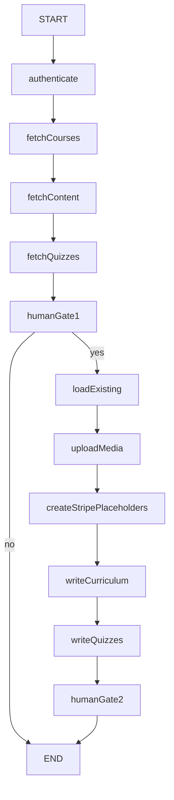

# WordPress Migration Agent

Standalone LangGraph agent that migrates course content from the WordPress/LearnDash site (`healthacademy.ca`) into this Next.js LMS. The agent fetches curriculum data via the WordPress REST API, uploads media to S3, and writes records directly to PostgreSQL via Prisma.

---

## Table of Contents

1. [Who This Is For](#1-who-this-is-for)
2. [What Gets Migrated](#2-what-gets-migrated)
3. [Terminology Mapping](#3-terminology-mapping)
4. [Prerequisites](#4-prerequisites)
5. [Environment Variables](#5-environment-variables)
6. [Running the Agent](#6-running-the-agent)
7. [Operator Guide — Human Gates](#7-operator-guide--human-gates)
8. [Post-Migration Checklist](#8-post-migration-checklist)
9. [Architecture Overview](#9-architecture-overview)
10. [Graph Phases and Nodes](#10-graph-phases-and-nodes)
11. [Developer Guide — File Structure](#11-developer-guide--file-structure)
12. [Developer Guide — State Shape](#12-developer-guide--state-shape)
13. [Developer Guide — Key Design Decisions](#13-developer-guide--key-design-decisions)
14. [Known Limitations and Schema Gaps](#14-known-limitations-and-schema-gaps)
15. [Troubleshooting](#15-troubleshooting)
16. [Related Documentation](#16-related-documentation)

---

## 1. Who This Is For

| Audience | Use this doc for |
|----------|------------------|
| **Operators / admins** | Running the migration, reviewing audit reports, completing post-migration fixes (Stripe, interactive verification) |
| **Developers** | Understanding graph structure, extending nodes, debugging failures, adding schema support for skipped question types |

This is a **one-time bulk migration tool**, not part of the running Next.js application. It is invoked from the command line and does not expose HTTP endpoints.

---

## 2. What Gets Migrated

Scope as of the June 2026 audit against `healthacademy.ca`:

| Resource | WordPress count | Next.js target |
|----------|----------------|----------------|
| Courses | 13 (6 published with content) | `Course` |
| Modules (WP Lessons) | 129 | `Chapter` |
| Topic pages (WP Topics) | 436 | `Lesson` |
| Quizzes | 121 | `Quiz` |
| Questions | 389 (all types migrated) | `QuizQuestion` + `QuizOption` |
| PDFs | 119 unique files | `LessonDocument` (re-uploaded to S3) |
| MP4 videos | 33 files | `LessonVideo` (re-uploaded to S3) |
| Course thumbnails | WP featured images | `Course.fileKey` (re-uploaded to S3) |
| Inline lesson images | extracted from topic HTML | Rewritten to S3 URLs in `Lesson.content` |
| YouTube embeds | extracted from topic HTML | `LessonVideo.youtubeUrl` |
| Interactive activities | 30 topics | `Lesson.interactiveScript` (HTML/JS, including React CDN modules) |

### WordPress vs. Next.js — Full Coverage Comparison

| WordPress Feature | Migrated? | Notes |
|-------------------|-----------|-------|
| Course metadata (title, slug, price, status) | ✅ Yes | `Course.title`, `Course.slug`, `Course.price`, `Course.status` |
| Course featured image (thumbnail) | ✅ Yes | Auto-uploaded to S3 from WP `_embedded` featured media |
| Module structure (WP Lessons → Chapters) | ✅ Yes | Ordered by `/steps` tree key insertion order |
| Topic pages (WP Topics → Lessons) | ✅ Yes | Full HTML content converted and stored |
| Quizzes (all statuses) | ✅ Yes | Created as `isPublished: false`; linked to course via steps tree |
| Single-choice questions (`single`) | ✅ Yes | Auto-graded via `QuizAnswerSelection` |
| Multiple-choice questions (`multiple`) | ✅ Yes | All-or-nothing grading |
| Essay questions (`essay`) | ✅ Yes | Stored as `QuestionType.essay`; not auto-graded |
| Assessment answers (`assessment_answer`) | ✅ Yes | Stored as `QuestionType.assessment`; ungraded survey type |
| Self-hosted MP4 videos | ✅ Yes | Downloaded from WP, re-uploaded to Tigris S3 |
| PDF documents | ✅ Yes | Downloaded from WP, re-uploaded to Tigris S3 |
| YouTube embeds | ✅ Yes | Extracted from topic HTML iframes |
| Inline lesson images | ✅ Yes | Downloaded from WP, re-uploaded to Tigris; URLs rewritten in content |
| Interactive HTML/JS activities | ✅ Yes | Stored in `Lesson.interactiveScript` (including React CDN modules) |
| Course ordering / hierarchy | ✅ Yes | Derived from `/ldlms/v2/sfwd-courses/{id}/steps` endpoint |
| User accounts and enrollments | ❌ No | Only course content structure is migrated |
| Learner progress records | ❌ No | All learners start fresh |
| Stripe products/prices | ⚠️ Placeholder | `MIGRATION_PENDING_{wpCourseId}` — real prices must be created manually |
| Courses without WP featured image | ⚠️ Placeholder | `fileKey: "MIGRATION_PENDING"` — thumbnail must be uploaded manually |
| Quizzes not linked to any course steps tree | ⚠️ Unlinked | Logged at Gate 2; may need manual placement |

### Not migrated automatically

- **User accounts, enrollments, and progress** — only course content structure
- **Quiz questions on quizzes missing from the WP steps tree** — logged as unlinked; may need manual placement
- **Courses without a WP featured image** — `fileKey: "MIGRATION_PENDING"` is retained; upload thumbnail manually in admin
- **Stripe products/prices** — placeholder `stripePriceId: "MIGRATION_PENDING_{wpCourseId}"` is written; create real Stripe prices before publishing

All migrated courses are created with `status: Draft` and `isPublished: false` on lessons/quizzes. Nothing is auto-published.

---

## 3. Terminology Mapping

LearnDash naming differs from this codebase:

| WordPress / LearnDash | Next.js / Prisma | Example |
|----------------------|------------------|---------|
| Course (`sfwd-courses`) | `Course` | "Natural Supplement Advisor" |
| Lesson (`sfwd-lessons`) | `Chapter` | "Module 1: Introduction…" |
| Topic (`sfwd-topic`) | `Lesson` | Individual content page |
| Quiz (`sfwd-quiz`) | `Quiz` | Chapter quiz |
| Question (`sfwd-question`) | `QuizQuestion` | Multiple-choice item |
| Answer option (`answers[]`) | `QuizOption` | `_answer` → `text`, `_correct` → `isCorrect` |

Curriculum **ordering** comes from the `/sfwd-courses/{id}/steps` endpoint, not from individual lesson/topic records. Object key insertion order in the steps tree determines `Chapter.position` and `Lesson.position`.

---

## 4. Prerequisites

1. **Node.js 18+** and project dependencies installed (`npm install`)
2. **PostgreSQL database** reachable via `DATABASE_URL` (local, staging, or production — use staging first)
3. **S3-compatible storage** (Tigris) configured with write access
4. **WordPress admin credentials** with JWT auth enabled on `healthacademy.ca`
5. **Admin user UUID** in the Next.js database — the user who will own migrated courses (`MIGRATION_OWNER_USER_ID`)

### Find the migration owner user ID

```bash
npx tsx --env-file=.env -e "
  import { prisma } from './lib/db';
  const users = await prisma.user.findMany({ where: { role: 'admin' }, select: { id: true, email: true, name: true } });
  console.table(users);
  await prisma.\$disconnect();
"
```

Use the `id` of the admin account that should appear as course author in the admin panel.

---

## 5. Environment Variables

Add these to your `.env` file (in addition to the standard app variables already required for database and S3):

| Variable | Required | Description |
|----------|----------|-------------|
| `WP_USERNAME` | Yes | WordPress admin username |
| `WP_PASSWORD` | Yes | WordPress admin password |
| `WP_BASE_URL` | No | Defaults to `https://healthacademy.ca/wp-json` |
| `MIGRATION_OWNER_USER_ID` | Yes | UUID of the NJ admin user who owns migrated courses |
| `DATABASE_URL` | Yes | PostgreSQL connection string |
| `S3_BUCKET_NAME` | Yes | Bucket for PDF/video uploads |
| `NEXT_PUBLIC_S3_PUBLIC_URL` | Yes | Public base URL for uploaded files |
| `AWS_REGION` | Yes | e.g. `auto` for Tigris |
| `AWS_ENDPOINT_URL_S3` | Yes | Tigris S3 endpoint |
| `AWS_ACCESS_KEY_ID` | Yes | S3 credentials |
| `AWS_SECRET_ACCESS_KEY` | Yes | S3 credentials |

Example `.env` block:

```env
WP_USERNAME=your-wp-username
WP_PASSWORD=your-wp-password
WP_BASE_URL=https://healthacademy.ca/wp-json
MIGRATION_OWNER_USER_ID=xxxxxxxx-xxxx-xxxx-xxxx-xxxxxxxxxxxx
```

The script validates all required variables at startup and exits with a clear error if any are missing.

---

## 6. Running the Agent

```bash
npm run migrate:wordpress
```

Equivalent:

```bash
npx tsx --env-file=.env migrate-wordpress.ts
```

### Expected console output (high level)

```
WordPress → Next.js Migration Agent
====================================

Thread ID: migration-1718300000000

=== Phase 0: Authenticating with WordPress ===
Authenticated as user ID 79

=== Phase 1a: Fetching courses and curriculum steps ===
...

=== Phase 2: Pre-Migration Audit (Human Gate 1) ===
{ ... JSON audit summary ... }

Type 'yes' to proceed with migration, or 'no' to abort:
```

After approval, the agent uploads media, writes to the database, and pauses again at Human Gate 2 with a final report.

### Aborting safely

At Human Gate 1, type `no` to abort. No database writes or media uploads occur — only WordPress data was fetched into memory.

### Re-running

The agent is **idempotent** — safe to re-run against a partially migrated database:

- **Neon:** Existing courses are matched by `slug`; chapters/lessons by `(courseId|chapterId, position)`; quizzes by `(courseId, chapterId, title)`. Only missing records are created; existing rows are not overwritten (null fields like `content` or `interactiveScript` may be filled).
- **S3:** Media uses deterministic keys derived from the WordPress URL (`wp-migration/{folder}/{hash}-{filename}`). Objects already in S3 or referenced in Neon are reused; only missing files are downloaded and uploaded.
- **Quizzes:** Empty quizzes from a prior run are matched and backfilled with missing `QuizQuestion` / `QuizOption` rows.
- **Stripe/thumbnails:** Real `stripePriceId` values are preserved; placeholders are only written for new courses. Course thumbnails are auto-uploaded from WP featured images when available; existing `fileKey` values (not `MIGRATION_PENDING`) are preserved on re-run.

Before any writes, the `loadExisting` node scans Neon and S3 and pre-populates `courseMap`, `chapterMap`, `lessonMap`, `quizMap`, `stripeMap`, `courseThumbnailMap`, and `mediaMap`.

---

## 7. Operator Guide — Human Gates

The agent has two **human-in-the-loop** interrupt points implemented with LangGraph's `interrupt()`.

### Gate 1 — Pre-migration audit (before any writes)

Displayed after all WordPress data is fetched. Review the JSON summary for:

| Section | What to check |
|---------|---------------|
| `courses` | Published vs draft counts; course names look correct |
| `content` | Lesson/topic/quiz/question counts match expectations |
| `interactive` | Total count; React CDN modules (Acetylcholine, Dopamine, GABA, Histamine, Serotonin) listed for verification — all stored in `interactiveScript` |
| `skippedQuestions` | Unknown WP question types only (all four known types are migrated) |
| `thumbnails` | Courses with vs without WP featured images |
| `mediaEstimate` | PDF, MP4, and inline image file counts |

**Prompt:** `Type 'yes' to proceed with migration, or 'no' to abort:`

- `yes` → continues to media upload and database writes
- `no` → graph ends; nothing written

### Gate 2 — Post-migration report (after all writes)

Displayed after curriculum and quizzes are written. Review:

| Section | What to check |
|---------|---------------|
| `recordsCreated` | Counts for courses, chapters, lessons, quizzes, questions, videos, documents |
| `mediaUploaded` | Upload success vs queue size; check for partial failures (PDFs, MP4s, images) |
| `actionItems.stripePriceFix` | Every course needs a real `stripePriceId` |
| `actionItems.thumbnailUpload` | Courses still missing thumbnails (only those without WP featured images) |
| `actionItems.reactCdnModules` | React CDN interactives stored in `interactiveScript` — verify they render in the learner dashboard |
| `actionItems.skippedQuestions` | Question IDs to enter manually |
| `errors` | Any per-item failures during upload or write |

**Prompt:** `Press Enter to acknowledge the final report and finish:`

---

## 8. Post-Migration Checklist

Complete these steps in the admin panel before publishing any migrated course:

- [ ] **Stripe prices** — For each course, create a Stripe product + price and update `Course.stripePriceId` (replace `MIGRATION_PENDING_*`)
- [ ] **Thumbnails** — Only needed for courses without a WP featured image (check Gate 2 `actionItems.thumbnailUpload`); all others are auto-uploaded to S3
- [ ] **Review content** — Spot-check lessons in admin; verify YouTube embeds, PDFs, and videos render in the learner dashboard
- [ ] **Interactive activities** — Confirm all 30 HTML/JS activities (including 5 React CDN modules) render in sandboxed iframes
- [ ] **Unlinked quiz questions** — Review Gate 2 warnings for questions whose parent quiz is not in any course steps tree
- [ ] **Publish** — Change `Course.status` from `Draft` to `Published` only after the above are complete
- [ ] **Lesson publish flags** — Set `Lesson.isPublished` and `Quiz.isPublished` as appropriate per course

---

## 9. Architecture Overview

```
migrate-wordpress.ts          ← CLI entry point (readline interrupt loop)
        │
        ▼
scripts/wp-migration/graph.ts ← LangGraph StateGraph (11 nodes, MemorySaver)
        │
        ├── wp-client.ts      ← JWT auth, paginated WP API fetcher
        ├── content-parser.ts ← HTML regex extractors, interactive detection
        ├── s3-uploader.ts    ← WP download → S3 PutObject
        └── nodes/            ← One file per graph node
                │
                ▼
        lib/db (Prisma)       ← Direct DB writes (bypasses server actions)
```



The graph uses `MemorySaver` as a checkpointer so interrupt/resume state is preserved within a single process run. Each invocation generates a unique `thread_id` (`migration-{timestamp}`).

---

## 10. Graph Phases and Nodes

| Phase | Node | File | Description |
|-------|------|------|-------------|
| 0 | `authenticate` | `nodes/authenticate.ts` | Obtain JWT; verify admin via `/wp/v2/users/me` |
| 1a | `fetchCourses` | `nodes/fetch-courses.ts` | Fetch 13 courses (with `?_embed=true` for featured images) + per-course `/steps` trees |
| 1b | `fetchContent` | `nodes/fetch-content.ts` | Paginate 129 lessons + 436 topics; classify interactive activities |
| 1c | `fetchQuizzes` | `nodes/fetch-quizzes.ts` | Paginate 121 quizzes + 389 questions; partition any unknown types |
| 2 | `humanGate1` | `nodes/human-gate-1.ts` | Print audit summary; `interrupt()` for approval |
| 2b | `loadExisting` | `nodes/load-existing.ts` | Scan Neon + S3; pre-populate ID maps, `courseThumbnailMap`, and `mediaMap` |
| 3 | `uploadMedia` | `nodes/upload-media.ts` | Upload missing PDFs/MP4s (3a), course thumbnails (3b), and inline images (3c) to S3 |
| 4 | `createStripePlaceholders` | `nodes/create-stripe-placeholders.ts` | Resolve `MIGRATION_PENDING_{wpCourseId}` or keep existing Stripe ID |
| 5a | `writeCurriculum` | `nodes/write-curriculum.ts` | Create or backfill Course → Chapter → Lesson cascade |
| 5b | `writeQuizzes` | `nodes/write-quizzes.ts` | Create or backfill Quiz → QuizQuestion → QuizOption |
| 6 | `humanGate2` | `nodes/human-gate-2.ts` | Print final report; `interrupt()` for acknowledgment |

### Content extraction (per topic HTML)

| Media type | Detection | Stored as |
|------------|-----------|-----------|
| YouTube | `<iframe src="...youtube.com/embed/{id}">` | `LessonVideo.youtubeUrl` |
| Self-hosted MP4 | `<video src="...mp4">` or `<source src="...mp4">` | `LessonVideo.videoKey` (after S3 upload) |
| PDF | `wp-block-file` div or plain `<a href="...pdf">` | `LessonDocument` (after S3 upload) |
| Course thumbnail | WP featured image (`?_embed=true`) | `Course.fileKey` (after S3 upload) |
| Inline image | `` in topic HTML | Rewritten to S3 URL in `Lesson.content` Tiptap JSON |
| Interactive HTML/JS | Title contains "interactive", or `<script>` + `id="*-module/root"` | `Lesson.interactiveScript` |

### Quiz question types

All four question types found on `healthacademy.ca` are fully imported:

| `question_type` | Count | Migrated as | Grading |
|----------------|-------|-------------|---------|
| `single` | 272 | `QuestionType.single` | Auto-graded (single correct answer) |
| `multiple` | 12 | `QuestionType.multiple` | Auto-graded (all-or-nothing) |
| `essay` | 3 | `QuestionType.essay` | Manual / not auto-graded; stored in `QuizAnswer.textResponse` |
| `assessment_answer` | 36 | `QuestionType.assessment` | Ungraded survey type |

Questions with an unrecognized `question_type` not in the above list are placed in `skippedQuestions` and reported at Gate 2 for manual entry.

---

## 11. Developer Guide — File Structure

```
migrate-wordpress.ts
scripts/wp-migration/
├── graph.ts                 # StateGraph assembly + compile
├── state.ts                 # MigrationAnnotation + WP/NJ TypeScript types
├── wp-client.ts             # WPClient class (auth, pagination, retry-on-401)
├── content-parser.ts        # Regex extractors, isInteractiveActivity, classifyActivity
├── idempotency.ts           # Neon/S3 existence checks, deterministic S3 keys
├── placement.ts             # Quiz placement from steps tree
├── s3-uploader.ts           # WP download → S3 PutObject (deterministic keys)
└── nodes/
    ├── authenticate.ts
    ├── fetch-courses.ts
    ├── fetch-content.ts
    ├── fetch-quizzes.ts
    ├── human-gate-1.ts
    ├── load-existing.ts
    ├── upload-media.ts
    ├── create-stripe-placeholders.ts
    ├── write-curriculum.ts
    ├── write-quizzes.ts
    └── human-gate-2.ts
```

### Dependencies

| Package | Purpose |
|---------|---------|
| `@langchain/langgraph` | `StateGraph`, `interrupt`, `MemorySaver`, `Command` |
| `@langchain/core` | Peer dependency |
| `he` | HTML entity decoding (`&amp;`, `&#8211;`, etc.) |
| `@aws-sdk/client-s3` | Media upload (already in project) |

### Adding a new node

1. Create `scripts/wp-migration/nodes/your-node.ts` exporting an async function `(state: MigrationState) => Partial<MigrationState>`
2. Register it in `graph.ts` with `.addNode()` and wire edges
3. Add any new state fields to `MigrationAnnotation` in `state.ts`
4. Update this documentation

### Extending content parsing

All regex patterns live in `content-parser.ts`. Patterns were validated against real topic HTML from `healthacademy.ca` — review the source HTML before modifying any extractors.

---

## 12. Developer Guide — State Shape

State is defined via `MigrationAnnotation` in `state.ts`. Key fields:

| Field | Type | Set by |
|-------|------|--------|
| `jwtToken` | `string` | `authenticate` |
| `wpCourses` | `WPCourse[]` | `fetchCourses` |
| `wpStepTrees` | `Record<number, StepsTree>` | `fetchCourses` |
| `wpLessons` | `WPLesson[]` | `fetchContent` |
| `wpTopics` | `WPTopic[]` | `fetchContent` |
| `wpQuizzes` | `WPQuiz[]` | `fetchQuizzes` |
| `wpQuestions` | `WPQuestion[]` | `fetchQuizzes` (all types: single, multiple, essay, assessment) |
| `skippedQuestions` | `WPQuestion[]` | `fetchQuizzes` (unknown types only) |
| `interactiveTopics` | `InteractiveTopicMeta[]` | `fetchContent` |
| `mediaQueue` | `string[]` | `uploadMedia` |
| `mediaMap` | `Record<string, MediaRef>` | `uploadMedia` |
| `courseThumbnailMap` | `Record<number, string>` | `loadExisting`, `uploadMedia` (WP course ID → S3 fileKey) |
| `stripeMap` | `Record<number, string>` | `createStripePlaceholders` |
| `courseMap` | `Record<number, string>` | `writeCurriculum` (WP ID → NJ UUID) |
| `chapterMap` | `Record<number, string>` | `writeCurriculum` |
| `lessonMap` | `Record<number, string>` | `writeCurriculum` |
| `quizMap` | `Record<number, string>` | `writeQuizzes` |
| `gate1Proceed` | `boolean` | `humanGate1` |
| `migrationStats` | `MigrationStats` | `uploadMedia`, `writeCurriculum`, `writeQuizzes` |
| `errors` | `string[]` | append-only across nodes |
| `migrationLog` | `LogEntry[]` | append-only across nodes |

---

## 13. Developer Guide — Key Design Decisions

### Direct Prisma, not server actions

The agent writes via `prisma` from `lib/db.ts` directly. Server actions are intentionally avoided because they:

- Enforce auth guards and Arcjet rate limits that break bulk operations
- Call Stripe during course creation
- **Silently drop `interactiveScript` on create** — the `createLesson` server action does not persist `interactiveScript` (only `updateLesson` does). Direct Prisma sets all fields in one write.

### Placeholder Stripe and thumbnails

Rather than creating live Stripe products during bulk migration, the agent writes `MIGRATION_PENDING_{wpCourseId}` as `stripePriceId` for new courses. Course thumbnails are auto-uploaded from WordPress featured images when available; courses without a featured image retain `fileKey: "MIGRATION_PENDING"` for manual upload in admin.

### Steps tree for ordering

The endpoint `/ldlms/v2/sfwd-courses/{id}/lessons` returns 404 on this site. Ordering is derived exclusively from `/ldlms/v2/sfwd-courses/{id}/steps`, iterating `Object.keys()` on the nested dict to preserve insertion order.

### S3 uploader is standalone

`s3-uploader.ts` creates its own `S3Client` from `process.env` rather than importing `lib/S3Client.ts`, which has `import "server-only"` and cannot be used in standalone scripts.

### JWT retry

`wp-client.ts` re-authenticates once on `401` or `jwt_auth_invalid_token`, then retries the failed request. Token TTL is 6 days — expiry mid-run is unlikely but handled.

### Course price

WordPress `price_type_paynow_price` is stored as integer dollars in `Course.price` (e.g. WP `"247"` → `247`), matching the admin course form convention.

---

## 14. Known Limitations and Schema Gaps

| Limitation | Workaround |
|------------|------------|
| Multi-select quiz questions (`multiple`) | Supported via `QuestionType.multiple` + `QuizAnswerSelection` |
| Essay questions (`essay`) | Supported via `QuestionType.essay` + `QuizAnswer.textResponse` (not auto-graded) |
| Assessment answer type (`assessment_answer`) | Supported as `QuestionType.assessment` (ungraded survey) |
| React CDN interactive modules (Acetylcholine, Dopamine, GABA, Histamine, Serotonin) | Stored in `Lesson.interactiveScript`; verify iframe rendering loads external React CDN scripts |
| H5P content | Not applicable — site's 30 interactive activities are custom HTML/JS, not H5P |
| Duplicate slug on re-run | Existing course matched by slug; missing children backfilled |
| Draft WP courses | Migrated as NJ `Draft` courses if they have a steps tree |

---

## 15. Troubleshooting

### `Missing required environment variables`

The script lists which variables are absent. Add them to `.env` and re-run with `--env-file=.env`.

### `JWT auth failed` / `rest_not_logged_in`

- Confirm `WP_USERNAME` and `WP_PASSWORD` are correct
- Basic Auth does not work on this site — only JWT Bearer tokens
- Verify the JWT Auth plugin is active on WordPress

### `Failed to parse JSON from /ldlms/v2/sfwd-topic`

Topic responses are large (~500 KB per page). The client strips null bytes before parsing. If this persists, check network stability or reduce concurrent load.

### Media upload failures

- PDFs and MP4s on `healthacademy.ca/wp-content/uploads/` are public — no WP auth needed for download
- Verify S3 credentials and bucket name
- Failed uploads are logged in `state.errors` and reported at Gate 2; the lesson is still created but without that document/video

### `MIGRATION_OWNER_USER_ID` user not found

Prisma will throw a foreign key error on course create. Verify the UUID exists in the `user` table.

### Quiz questions missing from migrated quizzes

Questions are linked to quizzes via the `quiz` field on the WP question object. If LearnDash returns questions without a `quiz` ID, they will not attach. Check `state.errors` and the skipped/unlinked counts in Gate 2 output.

### Graph stuck after interrupt

The CLI loop in `migrate-wordpress.ts` detects interrupts via `compiledGraph.getState()` and task `interrupts`. If running nodes programmatically outside the CLI, resume with:

```typescript
import { Command } from "@langchain/langgraph";

await compiledGraph.invoke(new Command({ resume: { proceed: true } }), config);
```

---

## 16. Related Documentation

| Document | Contents |
|----------|----------|
| [documentation/DATABASE_ERD.md](./DATABASE_ERD.md) | Target Prisma schema — `Course`, `Chapter`, `Lesson`, `Quiz`, etc. |
| [documentation/SERVICES.md](./SERVICES.md) | S3/Tigris storage, Stripe integration |
| [documentation/deployment.md](./deployment.md) | End-to-end deployment guide — environment setup, Neon, Tigris, Vercel, domain |
